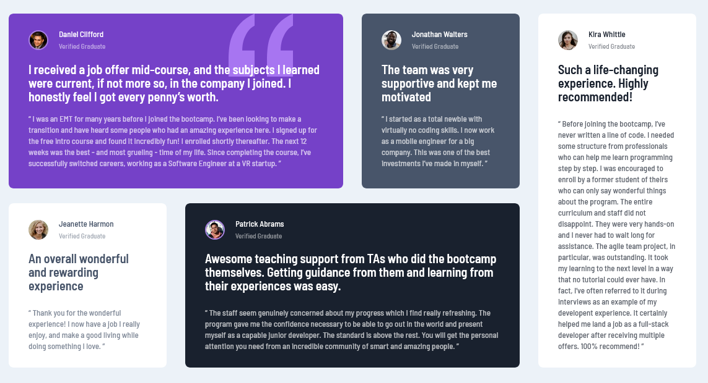

# Frontend Mentor - Testimonials grid section solution

This is a solution to the [Testimonials grid section challenge on Frontend Mentor](https://www.frontendmentor.io/challenges/testimonials-grid-section-Nnw6J7Un7). Frontend Mentor challenges help you improve your coding skills by building realistic projects. 

## Table of contents

- [Overview](#overview)
  - [The challenge](#the-challenge)
  - [Screenshot](#screenshot)
  - [Links](#links)
  - [My process](#my-process)
  - [Built with](#built-with)
  - [What I learned](#what-i-learned)
  - [Continued development](#continued-development)
  - [Author](#author)

## Overview
Frontend Mentor testimonial group challenge. The objective is to mach the  original design as close as posible with the use of CSS and HTML. 

### The challenge

Users should be able to:

- View the optimal layout for the site depending on their device's screen size

### Screenshot




### Links

- Solution URL: [Github](https://github.com/cacesasa/testimonial_grid)
- Live Site URL: [Github Pages](https://cacesasa.github.io/testimonial_grid/)

## My process
My development process is to first set my HTML using semantic tags, then divide the page in a grid and sub-devide as need it either by using grid or flex. After that I start coding and them testing for any errors on my design.

### Built with

- Semantic HTML5 markup
- CSS custom properties
- Flexbox
- CSS Grid
- Mobile-first workflow

### What I learned

I learned the use of CSS grid to format a page in accordance to the design specifications. 


```css
.testimonial_wrapper {
        width: 69.375rem;
        grid-template-columns: repeat(4, 1fr);
        grid-auto-columns: 1fr;
        column-gap: 1.875rem;
        row-gap: 1.5rem;
        grid-template: "first first second fifth"
                       "third fourth fourth fifth";
    }
```


### Continued development

Continue getting better at page layout, the use of CSS and semantic HTML.

## Author

- Frontend Mentor - [@cacesasa](https://www.frontendmentor.io/profile/cacesasa)
- Twitter - [@cacesasa](https://www.twitter.com/cacesasa)